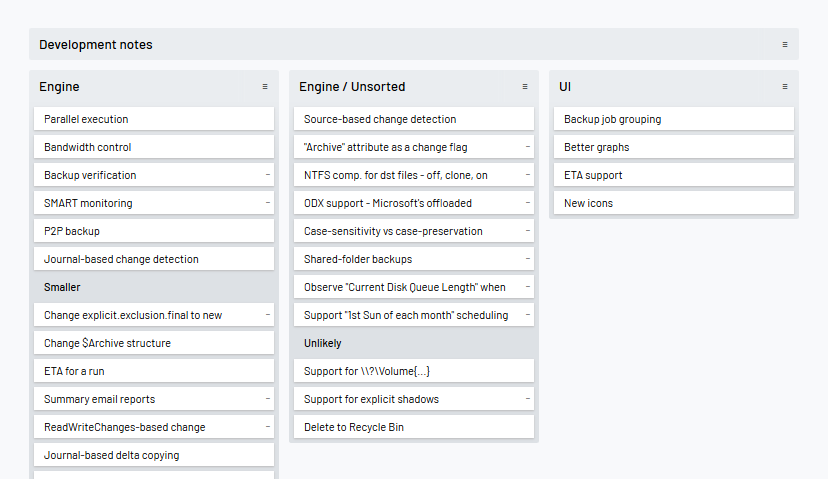
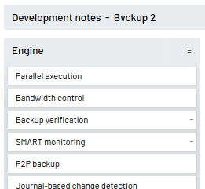
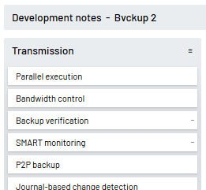
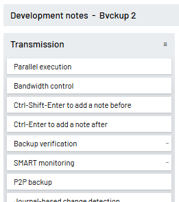
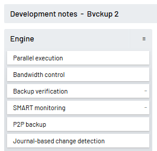
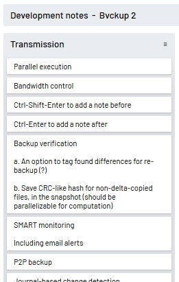
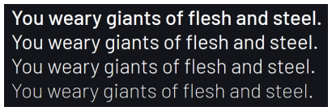
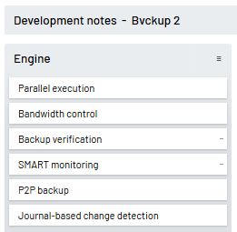
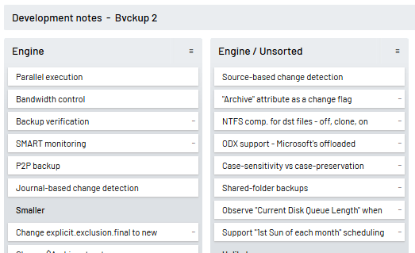
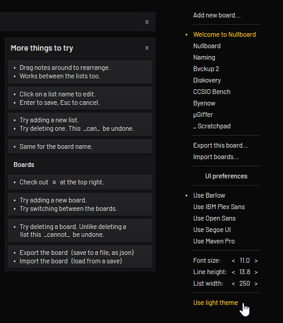

# Nullboard

Nullboard is a minimalist take on a kanban board / a task list manager, designed to be compact, readable and quick in use.

https://nullboard.io/preview

The name also happens to abbreviate to [NB](https://en.wikipedia.org/wiki/Nota_bene), which I think is a nice touch.

## Dead simple

* Single-page web app - just one HTML file, an ancient jQuery package and a webfont pack.
* Can be used completely offline. In fact, it's written exactly with this use in mind.

## Locally stored

* All data is stored locally, for now using [localStorage](https://developer.mozilla.org/en/docs/Web/API/Window/localStorage).
* The data can be exported to- or imported from a plain text file in a simple JSON format.
* The data can also be automatically backed up to a local disk with the help of:
  * [Nullboard Agent](https://nullboard.io/backups) - a native Windows app
  * [Nullboard Agent Express Port](https://github.com/justinpchang/nullboard-agent-express) - an express.js-based portable app
  * [nbagent](https://github.com/luismedel/nbagent) - a version for Unix systems, in Python

## Beta

Still very much in beta. Caveat emptor and all that.

## UI & UX

The whole thing is largely about making it convenient to use.

Everything is editable in place, all changes are saved automatically and last 50 revisions are kept for undo/redo:

New notes can be quickly added directly where they are needed, e.g. before or after existing notes:

Notes can also be dragged around, including to and from other lists:

Nearly all controls are hidden by default to reduce visual clutter to its minimum:

Longer notes can be collapsed to show just the first line, for even more compact view of the board:

The default font is [Barlow](https://tribby.com/fonts/barlow/) - it's both narrow *and* still very legible. Absolutely fantastic design!

Notes can also be set to look a bit different. This is useful for partitioning lists into sections:

Links starting with https:// and http:// are recognized. They will "pulse" on mouse hover and can be opened via the right-click menu.

Pressing CapsLock will highlight all links and make them left-clickable.

Lists can be moved around as well, though not as flashy as notes:

The font can be changed; its size and line height can be adjusted:

The color theme can be inverted:

Also:

* Support for multiple boards with near-instant switching
* Undo/redo for 50 revisions per board (configurable in the code)
* Keyboard shortcuts, including Tab'ing through notes

## Caveats

* Written for desktop and keyboard/mouse use
* Essentially untested on mobile devices and against tap/touch input
* Works in Firefox, tested in Chrome, should work in Safari and may work in Edge (or what it's called now)
* Uses localStorage for storing boards/lists/notes, so be careful around [clearing your cache](https://stackoverflow.com/questions/9948284/how-persistent-is-localstorage)

You spot a bug, file an issue.

## Dockerized version

See [this fork](https://github.com/rsoper/nullboard).

## Background

Nullboard is something that handles ToDo lists in the way that works really well. For *me* that is.

Tried a lot of options, some were almost *it*, but none was 100%.

**Trello** wasn't bad, but never was comfortable with the idea of storing my data in cloud without any actual need.

**Wekan** looked promising, but ultimately too heavy and had no offline usage support or a local storage option.

**Things** was beautiful, but not the right tool for the job.

**Inkscape** - I kid you not - with a laundry list of text items was actually OK, but didn't scale well.

Ditto for the plain **text files**.

Pieces of **paper** were almost there, but rearranging items can be quite a hassle.

So finally got annoyed enough to sit down and write exactly what I wanted.

And, voilà, Nullboard came out  =>  https://nullboard.io/preview

## License

The [2-clause BSD license](https://opensource.org/licenses/BSD-2-Clause/) with the [Commons Clause](https://commonsclause.com/).

That is, you can use, change and re-distribute it for as long as you don't try and sell it.

## Updates

Primary feed is through [@nullboard](https://twitter.com/nullboard) on Twitter.

The changelog is here => https://nullboard.io/changes
